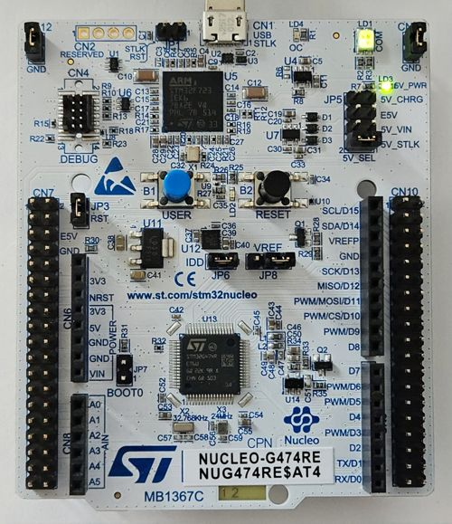

+++
title = "STM32G4xx project template"
date = 2025-08-25T20:15:00+01:00
authors = ["pashamray"]
description = "STM32G4xx project template"
tags = ["STM32", "STM32G4", "nucleo", "template", "project"]
draft=false
+++

Repository with project template for STM32G4xx microcontrollers and nucleo G4 board




## Repository

```shell
git clone --recurse-submodules https://github.com/pashamray/stm32g4xx-project-template
```

### References

- https://www.st.com/en/evaluation-tools/nucleo-g474re.html
- https://www.st.com/en/development-tools/stm32cubeide.html
- https://www.st.com/en/development-tools/stm32cubeprog.html
- https://www.st.com/en/embedded-software/x-cube-mcsdk.html
