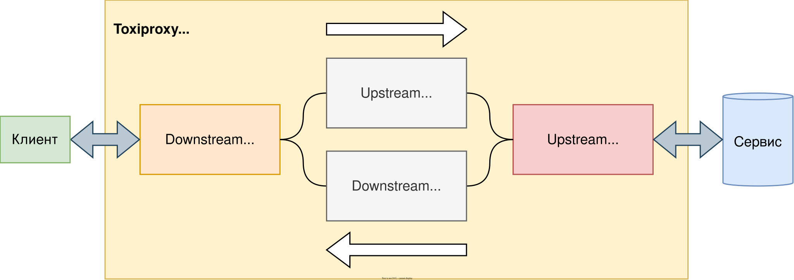

> Только дурак нуждается в порядке — гений господствует над хаосом
>
> -- <cite>Albert Einstein</cite>

Когда мы разрабатываем приложение, мы хотим, чтобы оно было стабильным и надежным.
Но как мы можем быть уверены, что наше приложение справится со сбоями, которые могут возникнуть во внешних сервисах, от которых оно зависит?
В этом случае нам может помочь инструмент под названием Toxiproxy.


[Toxiproxy](https://github.com/Shopify/toxiproxy) - это инструмент, который позволяет имитировать различные виды сбоев и ошибок во внешних сервисах, чтобы убедиться, что наше приложение правильно обрабатывает эти ситуации.
Мы можем использовать Toxiproxy для тестирования наших приложений на всех этапах разработки и убедиться в их надежности и стабильности.

В этой статье мы рассмотрим, как Toxiproxy помогает разработчикам тестировать приложения и избежать сбоев во внешних сервисах.
Расскажу о том, как работает Toxiproxy, как его использовать и какие преимущества он может принести для разработки наших приложений.

Для более удобной работы есть инструмент [toxiproxy-frontend](https://github.com/buckle/toxiproxy-frontend), веб морда для взаимодействия с сервером toxiproxy.
Так же существуют клиенты под разные языки, например для PHP [toxiproxy-php-client](https://github.com/ihsw/toxiproxy-php-client) или для Python [toxiproxy-python](https://github.com/douglas/toxiproxy-python), [список клиентов](https://github.com/Shopify/toxiproxy/pkgs/container/toxiproxy#clients) можно посмотреть в репозиторий проекта.

*Все материалы для этой статьй в [репозиторий на github](https://github.com/pashamray/toxiproxy-example).*

---

# Сервер

Для начала нам нужно поднять сервер toxiproxy, я буду использовать docker.

поднимаем сервер и наружу пробрасываем прорты

- **5000-5001** - порты на которых будем создавать прокси
- **8474** - порт сервера toxiproxy
- **9000** - порт nginx
- **9001** - порт веб морды для toxiproxy

```shell
docker-compose up -d
```

проверим что сервер поднялся
```shell
docker-compose ps
```

если всё хорошо, увидим примерно следующее
```shell
NAME                                     IMAGE                       COMMAND                  SERVICE              CREATED             STATUS              PORTS
toxiproxy_example-nginx-1                nginx                       "/docker-entrypoint.…"   nginx                3 seconds ago       Up 1 second         0.0.0.0:9000->80/tcp, :::9000->80/tcp
toxiproxy_example-toxiproxy-1            ghcr.io/shopify/toxiproxy   "/toxiproxy -host=0.…"   toxiproxy            3 seconds ago       Up 2 seconds        0.0.0.0:5000-5001->5000-5001/tcp, :::5000-5001->5000-5001/tcp, 0.0.0.0:8474->8474/tcp, :::8474->8474/tcp
toxiproxy_example-toxiproxy-frontend-1   buckle/toxiproxy-frontend   "java -jar server.jar"   toxiproxy-frontend   3 seconds ago       Up 1 second         0.0.0.0:9001->8080/tcp, :::9001->8080/tcp
```

проверим что наш nginx доступен снаружи, в ответ получим код стандартной страницы, всё хорошо

```shell
curl --silent --show-error http://localhost:9000 | grep "Welcome to nginx!"

<title>Welcome to nginx!</title>
<h1>Welcome to nginx!</h1>
```

---

## Прокси (Proxy)

Проверим что наш сервер toxiproxy доступен, в ответ получим пустой json, хорошо
```shell
curl --silent --show-error http://localhost:8474/proxies

{}
```

Создадим прокси для nginx в ответ получим json нашего прокси
```shell
curl --data '{"name": "proxy_nginx", "upstream": "nginx:80", "listen": "0.0.0.0:5000"}' localhost:8474/proxies
```

Посмотреть список прокси
```shell
curl localhost:8474/proxies
```

Если нужно удалить прокси
```shell
curl -X DELETE localhost:8474/proxies/proxy_nginx
```

проверим что наш прокси работает, тут указываем порт нашего прокси **5000**, в ответ получим код стандартной страницы, всё хорошо
```shell
curl --silent --show-error http://localhost:5000 | grep "Welcome to nginx!"

<title>Welcome to nginx!</title>
<h1>Welcome to nginx!</h1>
```

Перед тем как перейти к созданию токси, для начала провирим какая задержка без токси на наш nginx сервер через наш прокси.

запустим curl с помощью команды time, а полученные данные выкиним в /dev/null
```shell
time curl --silent --show-error http://localhost:5000 > /dev/null

________________________________________________________
Executed in    4.76 millis    fish           external
   usr time    3.82 millis  191.00 micros    3.62 millis
   sys time    0.08 millis   80.00 micros    0.00 millis
```
Здесь нас интересует **Executed in 4.76 millis**, это время за которое curl запустился, сделал запрос, получил ответ и завершился.

---

## Токсики (Toxics)

У всех токсиков есть общие атрибуты

Атрибуты:
- **type**: тип токсика
- **stream**: может принимать значения upstream или downstream, указывает к чему будет применятся токсик, когда запрос к серверу (Upstream) или ответ от сервера (Downstream)
- **toxicity**: устанавливает токсичность, где 1.0 = 100%



---

### Токсик задержки (Latency)

Сетевые задержки, когда запрос или ответ долго висит в ожиданий, после ожидания передача или получение данных идут на нормальной скорости.

Данный токси добавляет задержку для всех данных которые проходят через прокси.

Атрибуты:

- **latency**: задержка в милисекундах
- **jitter**:  дрожание в милисекундах

Задержка равна задержке +/- дрожание. Дрожание оно же мерцание, случайное на стабильное время задержки. То есть если мы создадим токси с latency = 1000 и jitter = 500, то получим случайную задержку от 0,5 до 1,5 сек. при каждом новом запросе.

Создадим такой токсик
```shell
curl --data '{"name":"latency_downstream","type":"latency","stream":"downstream","toxicity":1.0,"attributes":{"latency":1000,"jitter":500}}' localhost:8474/proxies/proxy_nginx/toxics
```

проверим отослав запрос несколько раз
```shell
time curl --silent --show-error http://localhost:5000 > /dev/null

________________________________________________________
Executed in  833.98 millis    fish           external
   usr time    4.72 millis  376.00 micros    4.35 millis
   sys time    0.16 millis  160.00 micros    0.00 millis
```

```shell
time curl --silent --show-error http://localhost:5000 > /dev/null

________________________________________________________
Executed in    1.37 secs      fish           external
   usr time    0.39 millis  390.00 micros    0.00 millis
   sys time    3.79 millis  167.00 micros    3.62 millis
```

```shell
time curl --silent --show-error http://localhost:5000 > /dev/null

________________________________________________________
Executed in  537.06 millis    fish           external
   usr time    4.65 millis  375.00 micros    4.27 millis
   sys time    0.17 millis  168.00 micros    0.00 millis
```

как видим время ответа сильно отличается всё работает как ожидалось

Можем удалим токсик
```shell
curl -X DELETE localhost:8474/proxies/proxy_nginx/toxics/latency_downstream
```

### Токсик (down)
Bringing a service down is not technically a toxic in the implementation of Toxiproxy. This is done by POSTing to /proxies/{proxy} and setting the enabled field to false.

### Токсик пропускной способности (Bandwidth)

Ограничивает соединение максимальным установленым количеством килобайт в секунду.

Атрибуты:
- **rate**: скорость в КБ/с

проверим насколько быстро скачается файл размером 10МБ без ограницений скорости

```shell
time curl --silent --show-error http://localhost:5000/large_file.bin > /dev/null

________________________________________________________
Executed in   13.93 millis    fish           external
   usr time    0.47 millis  468.00 micros    0.00 millis
   sys time    7.67 millis    0.00 micros    7.67 millis
```

Создадим токсик с ограничением скорости в 1000 КБ/с
```shell
curl --data '{"name":"bandwidth_downstream","type":"bandwidth","stream":"downstream","toxicity":1.0,"attributes":{"rate":1000}}' localhost:8474/proxies/proxy_nginx/toxics
```

Проверим сколько будет скачиваться файл
```shell
time curl --silent --show-error http://localhost:5000/large_file.bin > /dev/null

________________________________________________________
Executed in   10.49 secs      fish           external
   usr time   16.08 millis  366.00 micros   15.71 millis
   sys time   18.69 millis  169.00 micros   18.52 millis
```
примерно 10 секунд, работает как и ожидалось

Так же можно проверить ситуацию в которой нам важно получить данные от сервера за определённый отрезок времени, допустим не дольше 5 секунд
```shell
time curl --silent --show-error --max-time 5 http://localhost:5000/large_file.bin > /dev/null
curl: (28) Operation timed out after 5000 milliseconds with 4995216 out of 10485760 bytes received

________________________________________________________
Executed in    5.00 secs      fish           external
   usr time    4.72 millis  419.00 micros    4.30 millis
   sys time   17.27 millis  213.00 micros   17.06 millis
```
получили ошибку `Operation timed out after 5000 milliseconds` о том что не уложились в 5 секунд


Можем удалим токсик
```shell
curl -X DELETE localhost:8474/proxies/proxy_nginx/toxics/bandwidth_downstream
```

### Токсик (Slow close)
Delay the TCP socket from closing until delay has elapsed.

Атрибуты:
- **delay**: время в милисекундах

### Токсик таймаут (Timeout)
Останавливает передачу всех данных и закрывает соединение по истечении времени ожидания.
Если тайм-аут равен 0, соединение не будет закрыто, а данные будут отложены до тех пор, пока токсик не будет удален.

Атрибуты:
- **timeout**: время в милисекундах


создадим токсик 
```shell
curl --data '{"name":"timeout","type":"timeout","stream":"upstream","toxicity":1.0,"attributes":{"timeout":5000}}' localhost:8474/proxies/proxy_nginx/toxics
```

проверим как это работает
```shell
time curl --show-error --silent http://localhost:5000 | grep "Welcome to nginx!"
curl: (52) Empty reply from server

________________________________________________________
Executed in    5.01 secs      fish           external
   usr time    2.14 millis  556.00 micros    1.58 millis
   sys time    4.53 millis  277.00 micros    4.25 millis
```

как видим соединение было закрыто через 5 секунд

Можем удалим токсик
```shell
curl -X DELETE localhost:8474/proxies/proxy_nginx/toxics/timeout
```

### Токсик сброс (Reset peer)
Имитация TCP RESET (Connection reset by peer) для соединений путем закрытия заглушки Input немедленно или по истечении тайм-аута.

Атрибуты:
- **timeout**: время в милисекундах


создадим токсик
```shell
curl --data '{"name":"reset_peer","type":"reset_peer","stream":"downstream","toxicity":1.0,"attributes":{"timeout":5000}}' localhost:8474/proxies/proxy_nginx/toxics
```

проверим как это работает
```shell
time curl --silent --show-error http://localhost:5000/large_file.bin > /dev/null
curl: (52) Empty reply from server

________________________________________________________
Executed in    5.01 secs      fish           external
   usr time    0.00 millis    0.00 micros    0.00 millis
   sys time    5.00 millis  685.00 micros    4.31 millis
```

### Токсик (Slicer)
Нарезает данные TCP на маленькие биты, дополнительно добавляя задержку между каждым нарезанным «пакетом».

Атрибуты:
- **average_size**: размер пакета в байтах
- **size_variation**: изменение байтов среднего пакета (должно быть меньше, чем average_size)
- **delay**: время в микросекундах для задержки каждого пакета

создадим токсик
```shell
curl --data '{"name":"slicer_downstream","type":"slicer","stream":"downstream","toxicity":1.0,"attributes":{"average_size":10240,"size_variation":5120,"delay":100000}}' localhost:8474/proxies/proxy_nginx/toxics
```

проверим как это работает, запустим скачиваться файл
```shell
curl -vvv http://localhost:5000/large_file.bin > /dev/null
  % Total    % Received % Xferd  Average Speed   Time    Time     Time  Current
                                 Dload  Upload   Total   Spent    Left  Speed
  0     0    0     0    0     0      0      0 --:--:-- --:--:-- --:--:--     0*   Trying 127.0.0.1:5000...
* Connected to localhost (127.0.0.1) port 5000 (#0)
> GET /large_file.bin HTTP/1.1
> Host: localhost:5000
> User-Agent: curl/8.0.1
> Accept: */*
>
< HTTP/1.1 200 OK
< Server: nginx/1.23.3
< Date: Mon, 01 May 2023 12:41:31 GMT
< Content-Type: application/octet-stream
< Content-Length: 10485760
< Last-Modified: Wed, 08 Mar 2023 13:18:08 GMT
< Connection: keep-alive
< ETag: "64088b10-a00000"
< Accept-Ranges: bytes
<
  0 10.0M    0     0    0     0      0      0 --:--:-- --:--:-- --:--:--     0{ [7240 bytes data]
 21 10.0M   21 2222k    0     0   9846      0  0:17:44  0:03:51  0:13:53 10380
```

откроем `tcpdump` командой: 
```shell
sudo tcpdump -i lo -nn "port 5000"
```

нас интересует размер пакетов
```shell
14:45:52.781551 IP 127.0.0.1.38498 > 127.0.0.1.5000: Flags [.], ack 2587558, win 461, options [nop,nop,TS val 1778143690 ecr 1778143690], length 0
14:45:53.781988 IP 127.0.0.1.5000 > 127.0.0.1.38498: Flags [P.], seq 2587558:2592532, ack 92, win 512, options [nop,nop,TS val 1778144691 ecr 1778143690], length 4974
14:45:53.782030 IP 127.0.0.1.38498 > 127.0.0.1.5000: Flags [.], ack 2592532, win 488, options [nop,nop,TS val 1778144691 ecr 1778144691], length 0
14:45:54.782176 IP 127.0.0.1.5000 > 127.0.0.1.38498: Flags [P.], seq 2592532:2603414, ack 92, win 512, options [nop,nop,TS val 1778145691 ecr 1778144691], length 10882
14:45:54.782199 IP 127.0.0.1.38498 > 127.0.0.1.5000: Flags [.], ack 2603414, win 465, options [nop,nop,TS val 1778145691 ecr 1778145691], length 0
14:45:55.782285 IP 127.0.0.1.5000 > 127.0.0.1.38498: Flags [P.], seq 2603414:2612511, ack 92, win 512, options [nop,nop,TS val 1778146691 ecr 1778145691], length 9097
14:45:55.782329 IP 127.0.0.1.38498 > 127.0.0.1.5000: Flags [.], ack 2612511, win 472, options [nop,nop,TS val 1778146691 ecr 1778146691], length 0
14:45:56.782825 IP 127.0.0.1.5000 > 127.0.0.1.38498: Flags [P.], seq 2612511:2622115, ack 92, win 512, options [nop,nop,TS val 1778147692 ecr 1778146691], length 9604
14:45:56.782831 IP 127.0.0.1.38498 > 127.0.0.1.5000: Flags [.], ack 2622115, win 470, options [nop,nop,TS val 1778147692 ecr 1778147692], length 0
14:45:57.782934 IP 127.0.0.1.5000 > 127.0.0.1.38498: Flags [P.], seq 2622115:2636182, ack 92, win 512, options [nop,nop,TS val 1778148692 ecr 1778147692], length 14067
14:45:57.782942 IP 127.0.0.1.38498 > 127.0.0.1.5000: Flags [.], ack 2636182, win 453, options [nop,nop,TS val 1778148692 ecr 1778148692], length 0
14:45:58.783258 IP 127.0.0.1.5000 > 127.0.0.1.38498: Flags [P.], seq 2636182:2642631, ack 92, win 512, options [nop,nop,TS val 1778149692 ecr 1778148692], length 6449
14:45:58.783308 IP 127.0.0.1.38498 > 127.0.0.1.5000: Flags [.], ack 2642631, win 482, options [nop,nop,TS val 1778149692 ecr 1778149692], length 0
14:45:59.783622 IP 127.0.0.1.5000 > 127.0.0.1.38498: Flags [P.], seq 2642631:2654986, ack 92, win 512, options [nop,nop,TS val 1778150692 ecr 1778149692], length 12355
14:45:59.783665 IP 127.0.0.1.38498 > 127.0.0.1.5000: Flags [.], ack 2654986, win 459, options [nop,nop,TS val 1778150693 ecr 1778150692], length 0
14:46:00.784261 IP 127.0.0.1.5000 > 127.0.0.1.38498: Flags [P.], seq 2654986:2668950, ack 92, win 512, options [nop,nop,TS val 1778151693 ecr 1778150693], length 13964
```

### Токсик лимит данных (Limit data)
Закрывает соединение при превышении лимита передаваемых данных.

Атрибуты:
- **bytes**: количество байтов, которое он должен передать, прежде чем соединение будет закрыто

создадим токсик (создавать его на upstream не имеет смысла, только если мы не передаем данные на сервер)
```shell
curl --data '{"name":"limit_data","type":"limit_data","stream":"downstream","toxicity":1.0,"attributes":{"bytes":1000000}}' localhost:8474/proxies/proxy_nginx/toxics
```

проверим как это работает
```shell
time curl --silent --show-error http://localhost:5000/large_file.bin > /dev/null
curl: (18) transfer closed with 9486021 bytes remaining to read

________________________________________________________
Executed in    4.97 millis    fish           external
   usr time    1.93 millis  268.00 micros    1.66 millis
   sys time    1.68 millis    0.00 micros    1.68 millis
```

получили ошибку что было получено `9486021` и соединение было закрыто

Можем удалим токсик
```shell
curl -X DELETE localhost:8474/proxies/proxy_nginx/toxics/limit_data
```

##### ссылки

Youtube - [Chaos Engineering with ToxiProxy](https://www.youtube.com/watch?v=GVLQPE11Re0)