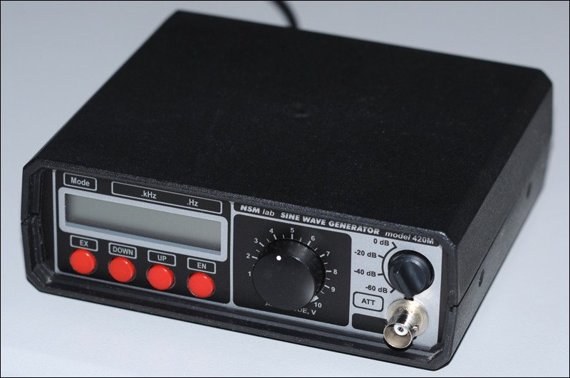
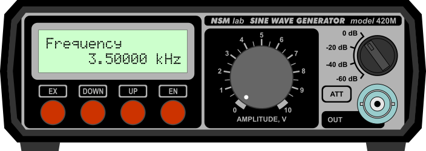
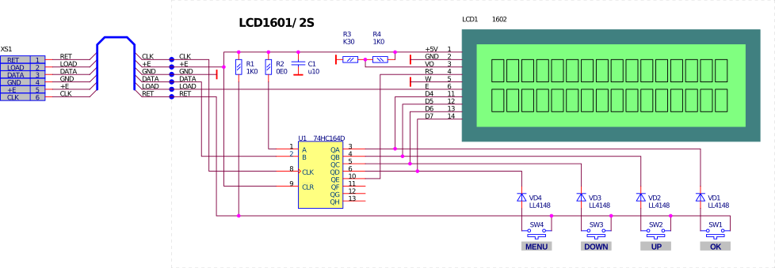

+++

title = "прошивка генератора SG-420M"
date = 2017-05-18T19:28:28+01:00
authors = ["pashamray"]
description = "Firmware for SG-420M"
tags = ["electronics", "SG-420M", "generator", "leoniv", "tda1543", "atmega8"]
draft = false

+++

Прошивка доступна в [репозиторий на github](https://github.com/pashamray/SG-420M).

Прошивка модифицирована для работы с экранами на контроллере [HD44780](https://ru.wikipedia.org/wiki/HD44780), размером 16x2, такими как WH1602. Подключение экрана аналогично подключению в частотомере [FC-510](http://leoniv.diod.club/projects/measuring/fc-510/fc-510.html)

#### Общий вид генератора

#### Вид лицевой панели

#### Схема подключения экрана

#### Автор конструкций генератора и базовой прошивки

Ридико Леонид Иванович
* http://www.leoniv.diod.club
* http://leoniv.livejournal.com
* wubblick@yahoo.com