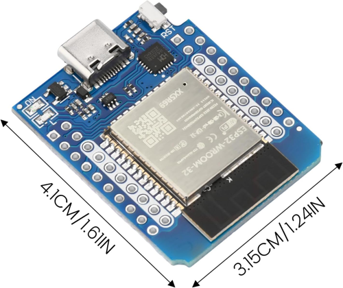
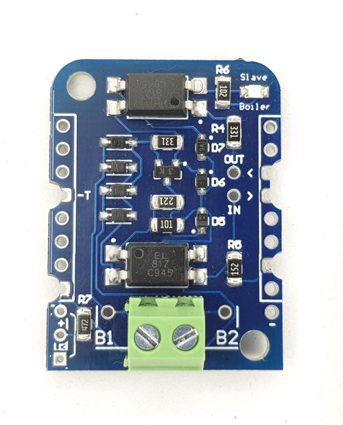

+++

title = "ESP32 + OpenTherm + Brink Renovent HR Medium"
date = 2025-01-22T21:07:28+01:00
authors = ["pashamray"]
description = "ESP32 + OpenTherm + Brink Renovent HR Medium"
tags = ["esp32", "Arduino", "OpenTherm", "Brink", "Renovent", "Brink Renovent HR"]
draft = false

+++

https://github.com/pashamray/brink-opentherm-controller

### Intro

Имеется система вентиляции Brink Renovent HR Medium, которая имеет 3 скорости работы: низкая, средняя, высокая.
При этом, в зависимости от времени года или времени суток, необходимо переключать скорости работы системы.

_image source: https://www.brinkclimatesystems.nl_
_pdf: https://www.brinkclimatesystems.nl/documenten/renovent-hr-medium-large-611925.pdf_

Скорости переключаются с помощью настенного переключателя, но бегать к переключателю напрягает.
Переключатель имеет 3 положения:

- 1 - низкая скорость
- 2 - средняя скорость
- 3 - высокая скорость
led - индикатор замены фильтра

_image source: https://www.ventilatieland.nl/nl_NL/p/zehnder-stork-drie-standen-schakelaar-sai-1-3v-inbouw/5959/_

Первая мысть была использовать реле для переключения скорости работы системы вентиляции, но скачав документацию на систему вентиляции, оказалось, что система имеет интерфейс [OpenTherm](https://www.opentherm.eu/), [OpenTherm Wiki](https://en.wikipedia.org/wiki/OpenTherm), его можно использовать для управления.

Погуглив, нашел модули для подключения и примеры реализации для ESP32 [Wiki](https://en.wikipedia.org/wiki/ESP32)
Буду использовать **ESP32** для подключения к интерфейсу OpenTherm и управления скоростями работы системы вентиляции.

### Hardware
Заказал модули ESP32
тут: https://www.amazon.nl/dp/B0D9LFM1MG?ref=ppx_yo2ov_dt_b_fed_asin_title

_image source: https://www.amazon.nl/dp/B0D9LFM1MG?ref=ppx_yo2ov_dt_b_fed_asin_title_

так же заказал модули **Master OpenTherm Shield** 
тут: https://diyless.com/product/master-opentherm-shield

_image source: https://diyless.com/product/master-opentherm-shield_

### Firmware

Покопавшись в интернете, нашел arduino библиотеку для работы с интерфейсом OpenTherm для ESP32 https://github.com/Sidiox/opentherm_library и пример использования https://github.com/Sidiox/hrv-control.
Это форк библиотеки https://github.com/ihormelnyk/opentherm_library в которую была добавленна поддержка системы вентиляции Brink Renovent HR.
Установить библиотеку необходимо скачав zip архив и установив через Arduino IDE.

Так же в https://github.com/ihormelnyk/opentherm_library в ветке **master** были добавлены ай-ди для работы с системой вентиляции.
Под эту библиотеку и писалась прошивка.

Устройство умеет:

- [x] принимать команды
    - [x] ping - отвечает pong, используется для проверки
    - [x] set - установка параметров
        - [x] - set speed 0, 10, 50, 100...
        - [x] - set wifi ssid@pass
    - [x] get - считывание параметров
        - [x] - get speed
        - [x] - get wifi
- [x] Управление устройством через последовательный порт
- [x] Сохранение настроек в EEPROM (перенести на [Preferences](https://docs.arduino.cc/libraries/preferences/))
- [ ] Управление устройством через WEB интерфейс
- [ ] Управление устройством через приложение локально (без интернета)
- [ ] Управление устройством через приложение глобально (через интернет)

Прошивка доступна по ссылке https://github.com/pashamray/brink-opentherm-controller.git

### Software

Для управления устройством, необходимо использовать последовательный порт, для этого можно использовать:
- [Arduino Serial Monitor](https://www.arduino.cc/en/Guide/Environment#serial-monitor) 
- [CoolTerm](https://freeware.the-meiers.org/)
- [PuTTY](https://www.putty.org/)
- screen (Linux)
- picocom (Linux)
- Serial USB terminal (Android)

### References
- https://otgw.tclcode.com/
- https://github.com/jpraus/arduino-opentherm
- https://portegi.es/blog/opentherm-wtw-1
- https://portegi.es/blog/opentherm-wtw-2
- https://github.com/Sidiox/opentherm_library
- https://github.com/Sidiox/hrv-control
- https://github.com/tijsverkoyen/Home-Assistant-BrinkRenoventHR
- https://github.com/raf1000/brink_openhab
- https://github.com/ihormelnyk/opentherm_library
- https://ihormelnyk.com/opentherm_adapter
- https://github.com/Jeroen88/EasyOpenTherm
- https://www.opentherm.eu/wp-content/uploads/2016/06/OpenTherm-Function-Matrix-v1_0.xls
